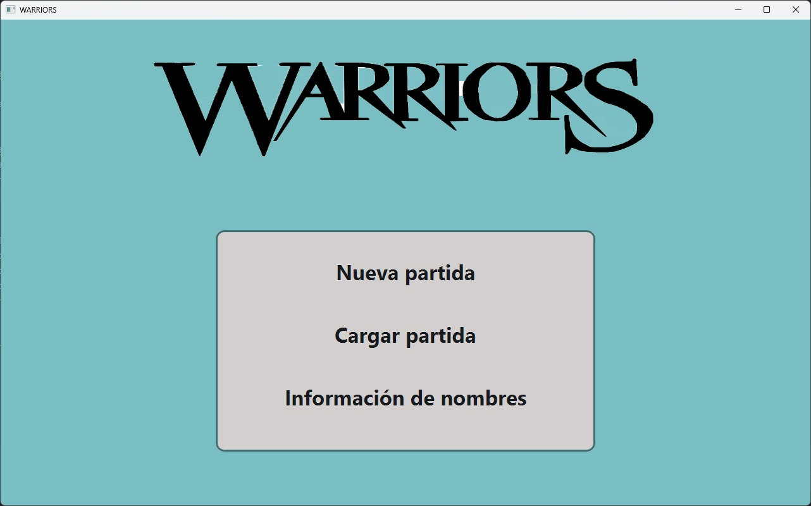
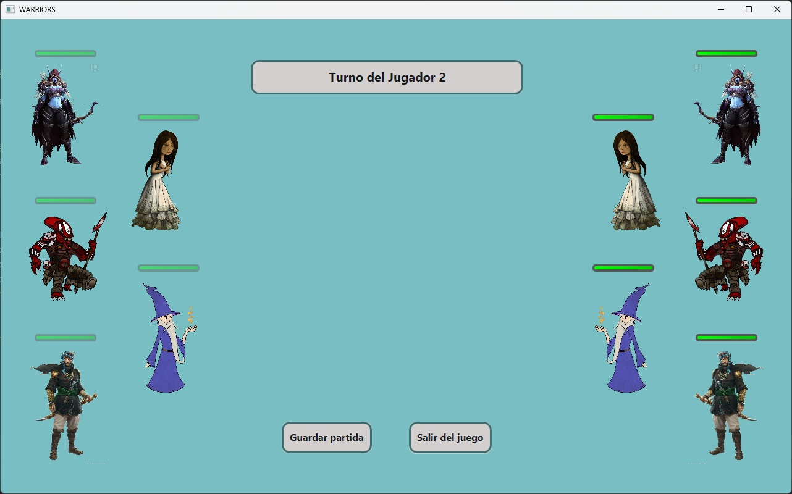
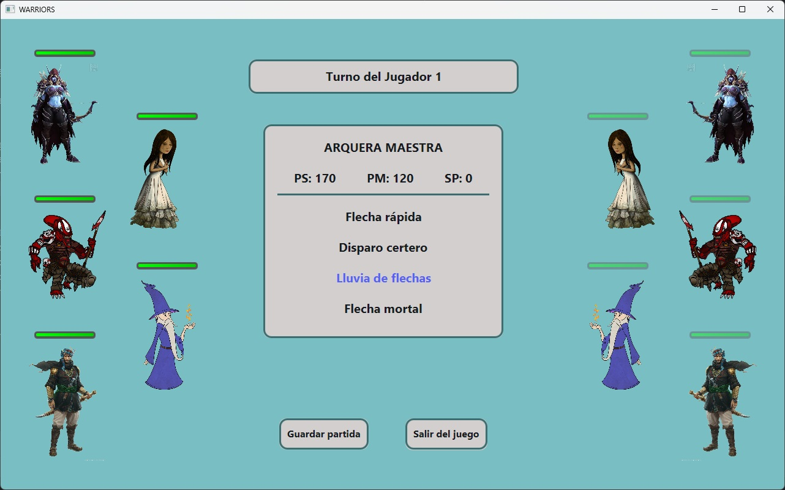
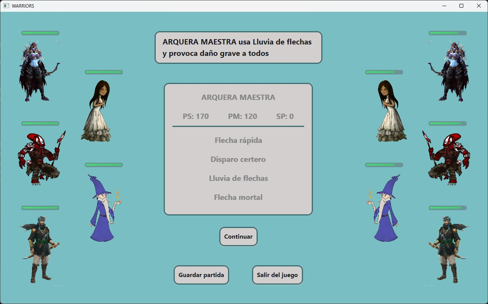
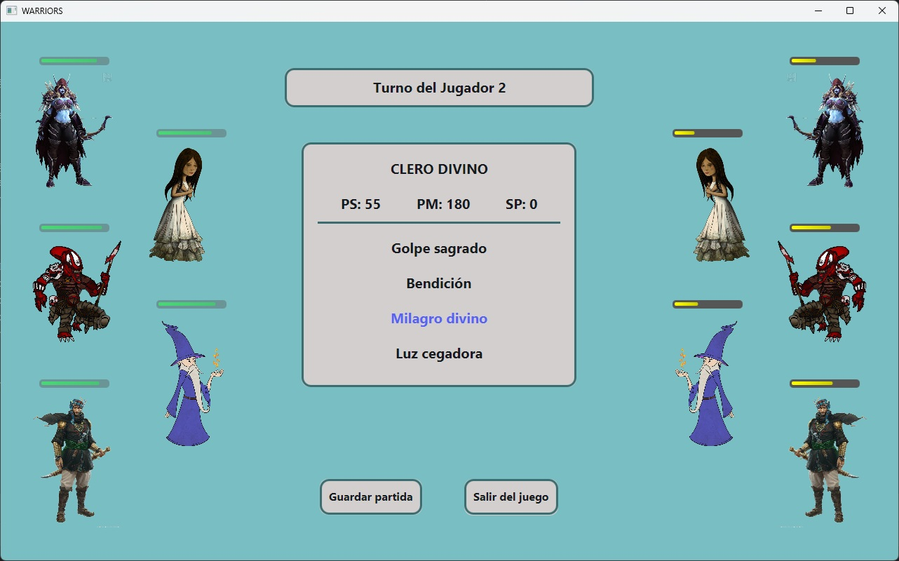
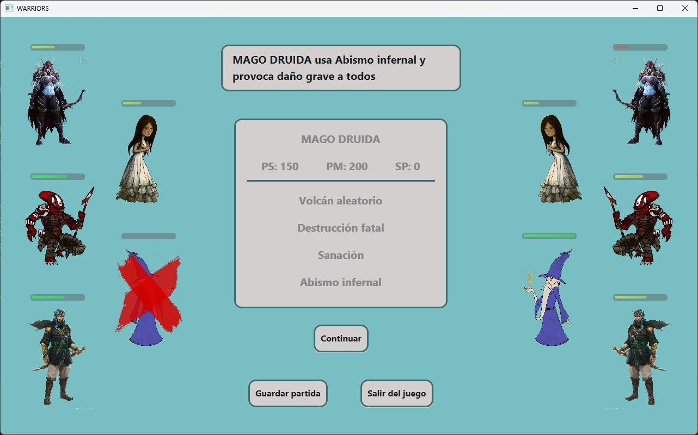

# Warriors - Juego de Rol por Turnos (RPG Battle)

Juego de rol por turnos en Java (JavaFX) en el que dos equipos de personajes se enfrentan usando ataques ofensivos, curaciones y gestión de maná, hasta que un equipo queda completamente eliminado.

---

## Capturas del Juego








---

## Funcionalidades y Mecánicas de Juego

- **Combate por turnos:** dos equipos (`Equipo`) se alternan turno a turno hasta que uno se queda sin personajes vivos.
- **Sistema de ataques polimórfico:** cada ataque hereda de la clase abstracta `Ataque` y decide por sí mismo cómo calcular su efecto (`AtaqueOfensivo` resta salud, `AtaqueCurativo` la restaura), sin necesidad de `instanceof` ni casting en el código que los ejecuta.
- **Tipos de objetivo:** cada ataque define contra quién puede lanzarse (`ENEMIGO_ELEGIDO`, `ENEMIGO_RANDOM`, `TODOS_ENEMIGOS` como área de efecto, o `ALIADO_ELEGIDO` para curaciones), permitiendo que el controlador de la interfaz decida el flujo de selección sin lógica condicional compleja.
- **Gestión de maná:** cada ataque tiene un coste de maná que se descuenta al personaje al lanzarlo.
- **Cálculo de daño/curación aleatorio:** cada ataque define un rango (`minValue`–`maxValue`) del que se calcula el valor real aplicado en cada turno.
- **Guardado y carga de partidas:** la partida completa se serializa a fichero (`ObjectOutputStream`/`ObjectInputStream`), permitiendo continuar una batalla guardada previamente.
- **Detección de victoria:** al eliminarse todos los personajes de un equipo, la partida finaliza y se determina el equipo ganador automáticamente.

---

## Arquitectura y Buenas Prácticas Aplicadas

- **Polimorfismo:** la clase abstracta `Ataque` define los métodos `lanzarAtaque`, `aplicarEfecto` y `getTipoObjetivo`; cada subtipo implementa su propia lógica, y el resto del código nunca necesita comprobar el tipo concreto.
- **Records de Java:** `EfectoPersonaje` y `ResultadoAtaque` se modelan como `record`, aprovechando la inmutabilidad y concisión de esta característica moderna del lenguaje para transportar resultados de combate.
- **Separación en capa de Service:** `BatallaService` encapsula la lógica pura de resolución de un ataque (sin dependencias de JavaFX), dejando explícitamente preparado el terreno para una futura migración a un `@Service` de Spring Boot expuesto como endpoint REST.
- **`PartidaUI` como capa de presentación:** separa el estado del juego (`Partida`, serializable) de su representación visual en JavaFX (`Map<VBox, Nombres>`), evitando acoplar la lógica de negocio a la interfaz.
- **Lombok:** `@Getter`, `@Setter`, `@AllArgsConstructor`, `@NoArgsConstructor` para reducir el código repetitivo en los modelos.
- **Manejo de errores robusto:** `FileService` gestiona de forma explícita cada excepción de E/S al guardar o cargar partidas, devolviendo resultados informativos mediante el `record ResultFileService`.

---

## Modelo de Dominio

| Clase / Interfaz | Responsabilidad |
|---|---|
| `Ataque` (abstracta) | Define el contrato común de cualquier ataque/hechizo |
| `AtaqueOfensivo` | Calcula y aplica daño a uno, varios o todos los enemigos |
| `AtaqueCurativo` | Calcula y aplica curación a un aliado elegido |
| `TipoObjetivo` (enum) | Define contra quién se puede lanzar cada ataque |
| `Personaje` | Entidad con salud, maná y lista de ataques disponibles |
| `Equipo` | Conjunto de personajes de un jugador, con consulta de vivos/eliminados |
| `Partida` | Estado global de la partida: equipos, turno actual y resultado |
| `BatallaService` | Lógica pura de resolución de un turno de combate |
| `FileService` | Persistencia de la partida mediante serialización de objetos |

---

## Estructura del Proyecto

```text
src/main/java/org/zeki/rolgame/
├── model/
│   ├── ataque/       # Ataque, AtaqueOfensivo, AtaqueCurativo, TipoObjetivo
│   ├── personaje/    # Personaje, Nombres
│   ├── Equipo.java, Partida.java, EfectoPersonaje.java, ResultadoAtaque.java
├── service/          # BatallaService, FileService, ResultFileService
├── controller/        # PartidaUI y controladores de la interfaz JavaFX
└── util/              # PathsHelper
```

---

## Cómo ejecutar el proyecto

```bash
git clone https://github.com/TamezeDev/Warriors.git
```

Ábrelo con un IDE compatible con JavaFX (IntelliJ IDEA recomendado) y ejecuta la clase principal.
